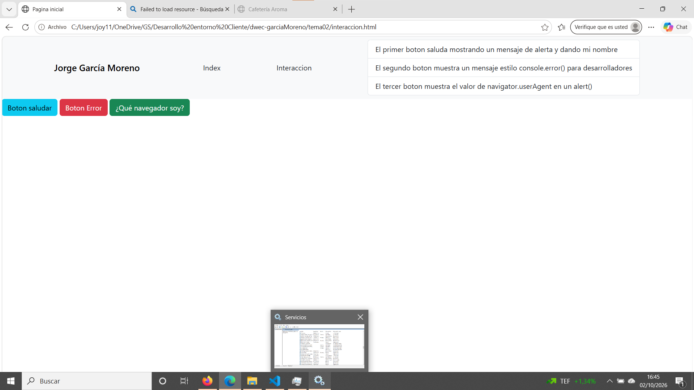
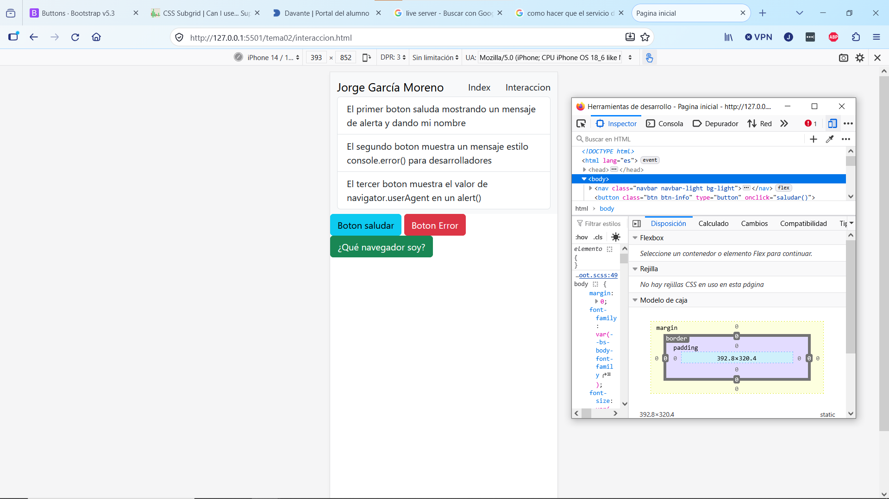
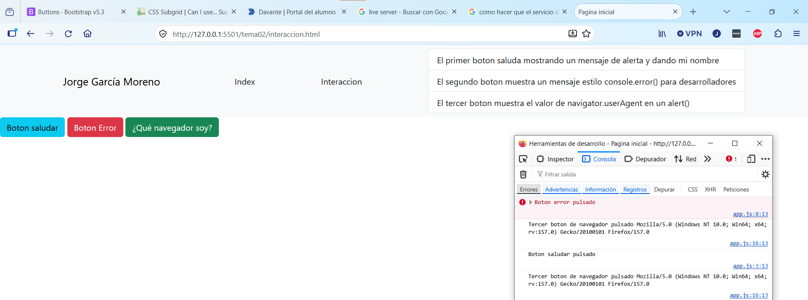
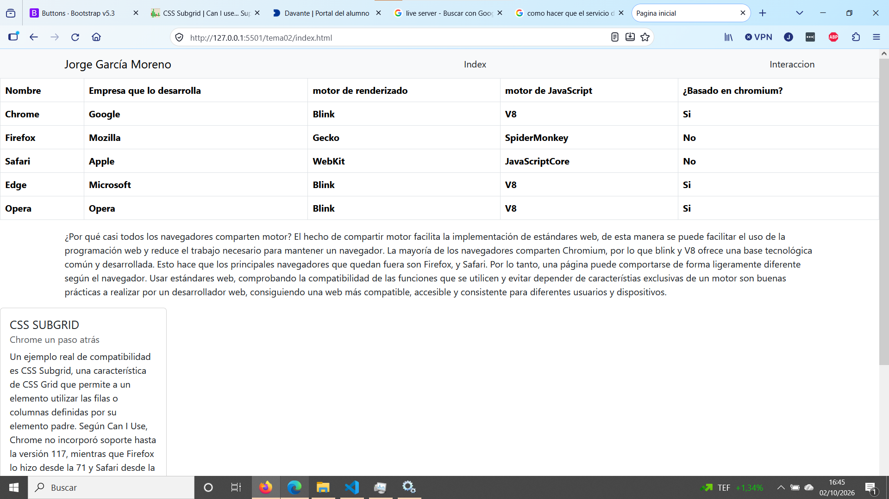
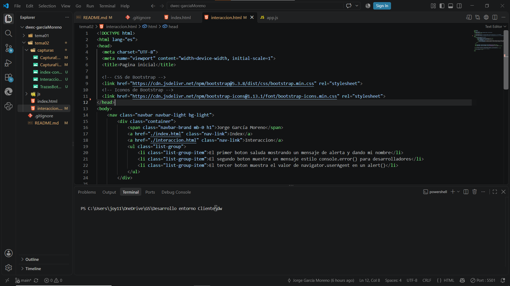

# Tarea 2. Navegadores, motores y mi primera página interactiva

**Autor:** Jorge García Moreno
**Asignatura:** Desarrollo Web Entornos Cliente · Tema 2

Sitio de dos páginas con Bootstrap: `index.html` (navegadores y motores) e `interaccion.html` (tres botones con JavaScript y trazas en la consola). Lo he probado con Live Server en [MicrosoftEdge] y [Firefox].

## 1. Capturas

### a) index.html en el ordenador

[Se ve la página de navegadores con mi nombre en la navbar y la tabla de los cinco navegadores.]

### b) interaccion.html en modo dispositivo

[Vista de F12 → barra de dispositivos simulando un móvil: los botones se apilan y no hay scroll horizontal.]

### c) Consola con las trazas de los tres botones

[Aparecen el console.log de «Saludar», el console.error en rojo de «Simular un error» y el console.log del userAgent.]

### d) alert() de «¿Qué navegador soy?» en los dos navegadores

[Cada navegador muestra un userAgent distinto.]

### e) VS Code con Live Server

[Carpeta tema02 abierta en VS Code y Live Server en marcha.]

## 2. Quién hace qué (botón «Saludar»)

- **HTML:** Crea el botón con `<button type="button" onclick="saludar()">` y el atributo `onclick`, que indica qué función se ejecuta al pulsar.
- **Bootstrap (CSS):** Utilizo el estilo determinado por la biblioteca de css de Bootstrap.
- **JavaScript:** La función `saludar()` de `app.js` es la que hace algo: escribe una traza con `console.log()` y muestra un `alert()` con mi nombre.

## 3. Comparación de los dos userAgent
EN el de Firefox puede observar que utiliza Gecko mientras que el de Microsoft Edge se ve que utiliza como motor Chrome.

## 4. Fuentes consultadas

- [Apuntes y presentación del Tema 2 (campus virtual)]
- [Enlace para conocer sobre Chromium y Blink](https://www.chromium.org/blink/?utm_source=chatgpt.com)
- [StatCounter para conocer los buscadores web mas usados](https://gs.statcounter.com/browser-market-share/desktop-mobile/spain?utm_source=chatgpt.com)
- [Can I use: nombre de la característica](https://caniuse.com/enlace-exacto)

## Uso de IA

He usado [Claude] para orientarme en la estructura del README. Después [escribí y probé yo el código, lo adapté a mi proyecto y redacté con mis palabras las explicaciones y la comparación de los userAgent].