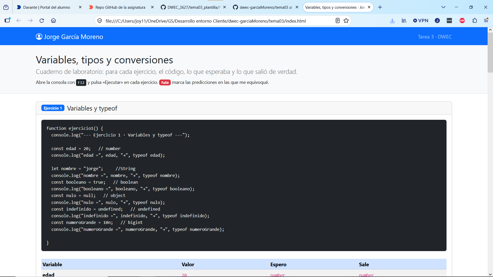
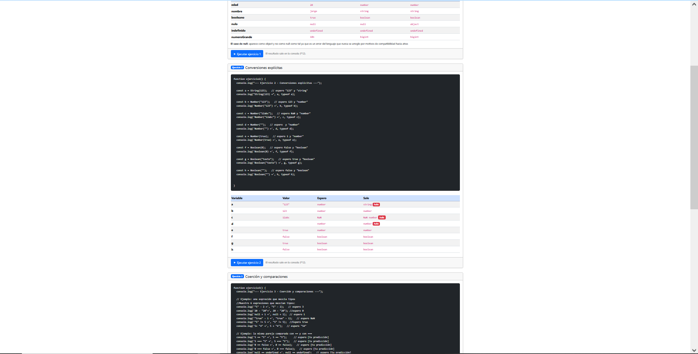
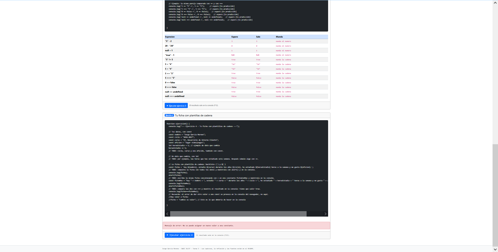
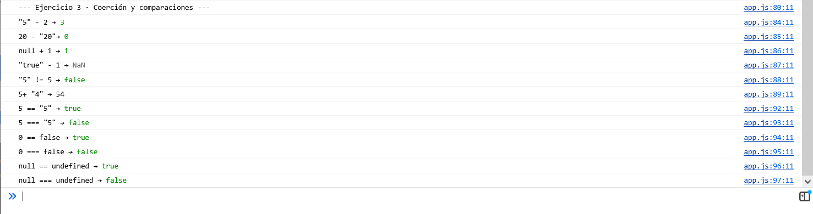

# Tarea 3 · Variables, tipos y conversiones

**Autor:** Jorge García Moreno · Desarrollo Web en Entorno Cliente (DWEC) · 2.º DAW · Curso 2026-27

## Capturas

### a) La página entera

En esta parte se puede observar en las 3 fotografías como se estructura el html de la práctica, primero el enunciado, luego el código de javascript y por último el resultado en un card del código al ejecutuarlo dándole al botón. En las predicciones en las que me he equivocado, he marcado un FALLÉ al lado del resultado final y correcto.

### b) Consola del ejercicio 1

Se puede observar como se declaran variables y se inicializan a distintos valores, devolviendo con una flecha el tipo de dato de cada una

### c) Consola del ejercicio 2

En este tipo de ejercicio se puede observar como se hace un casting o cambio de valor a ciertas variables, intentando asignar numeros a variables de tipo Number por ejemplo

### d) Consola del ejercicio 3

En este tipo de ejercicio se intentan realizar operaciones básicas con distintos tipos de variables, se puede observar como se intentan concatenar strings y numéros y se convierte todo a un string, por ejemplo

### e) Consola del ejercicio 4, con el error de la const

Se puede ver el titulo del ejercicio y dos textos que corresponden a las dos variables creadas con la estructura que se ha especificado, con $ y backticks y la otra concatenando +. Ademas, cómo se puede capturar un error al intentar cambiar el valor a una variable de visibilidad const.

## Reflexión

Las conversiones en las que intervienen numeros y strings me resultaron intuitivas, conociendo que si cuando realizas operaciones con - o *, pueden resultar en una salida de tipo NaN. Las variables en las que he obtenido una sopresa inicial ha sido con "123", ya que esperaba que resultase en un intero o comentando de forma inicial que no se puede asignar ese valor, también me ha sorprendido que en 12abc diera NaN de primeras, ya que pensaba que iba a devolver un String recogiendo todos los valores. De igual manera en el asignar una variable nula a un number, pensé que iba a resultar en un valor vacío, pero realmente aunque no inicializase la variable con algún valor, se quedó correctamente con su tipo y no resultó en un tipo null. Los booleanos sí que tenía conocimiento de que aunque le agregase el resultado por texto, si iban a recoger y a mostrar correctamente su tipo.
## Fuentes

- [\[Título de la página\]](https://getbootstrap.com/docs/5.3/getting-started/introduction/) He consultado a lo largo de la semana la documentación de Bootstrap para ir repasando cada una de las estructuras que hemos utilizado.

## Uso de IA

En esta práctica no he empleado en ningún momento la IA, ni he tenido que realizar ninguna consulta externa, ya que el guión estaba muy bien realizado y realmente alguno de los ejercicios daban pie a que podíamos equivocarnos en las predicciones para posteriormente compararlas con el resultado.
